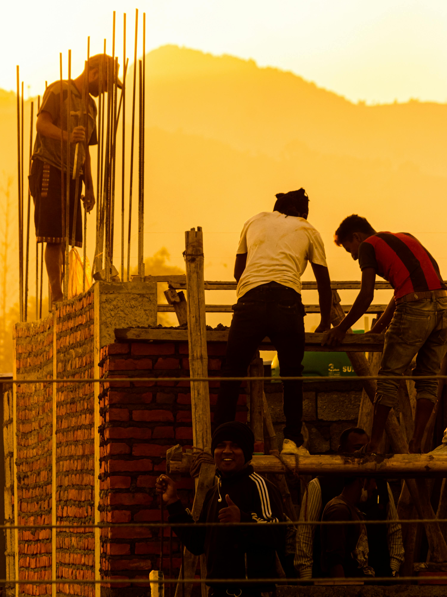
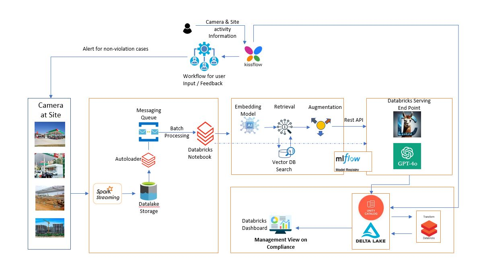

# GuardianVision

GuardianVision is an AI-powered safety monitoring app that analyzes live video feeds from cameras every 30 seconds. It detects safety violations based on customizable checklists for construction and maintenance sites, using a multi-modal LLM to generate real-time alerts and help prevent accidents.

## Abstract

Every year, occupational accidents and work-related diseases claim 2.78 million lives globally, with an additional 374 million workers sustaining non-fatal injuries, underscoring a critical need for more robust safety monitoring solutions.

Traditional safety enforcement depends on manual supervision, which is often limited in scope and consistency, especially in high-risk sectors such as construction. The construction industry alone accounts for one in five workplace fatalities, with 1,069 deaths reported in the U.S. in 2022—an 8% increase from the previous year. Falls are the leading cause, responsible for 38.4% of these fatalities, highlighting an urgent requirement for scalable, real-time safety compliance monitoring.

Current computer vision models based on object detection techniques, like YOLO, aim to automate PPE detection, identifying items such as hard hats and safety vests. However, these models lack scalability in adapting to varied safety equipment needs across different work conditions.

For instance, detecting specialized equipment like harnesses in fall-prone areas would require extensive retraining and customization, as these models are not designed to dynamically adjust to task-specific risks. To overcome these limitations, we introduce a novel, adaptive safety compliance system that leverages Retrieval-Augmented Generation (RAG) for dynamic checklist generation, paired with multimodal large language models (LLMs) for enhanced, context-aware safety evaluations.

By using a brief task description to create a tailored checklist through RAG, our system enables a multimodal LLM to assess image and video feeds for compliance, detect safety gaps, assign risk scores, and trigger proactive alerts.

Evaluated on a dataset of open-source and proprietary construction site images, our approach achieved an 85% success rate in identifying unsafe scenarios and a 95% accuracy in validating safe conditions, outperforming existing benchmarks.

This adaptable framework is applicable across diverse industries, including healthcare, chemical manufacturing, and heavy machinery, positioning it as a transformative, cross-sector solution for advancing workplace safety. Integrating AI-driven, context-sensitive adaptability, our system marks a significant advancement in preventing occupational hazards and ensuring compliance at scale.

## Features
- **Real-time Monitoring**: Analyzes video feeds every 30 seconds.
- **Customizable Checklists**: Tailor the safety criteria based on the specific site and activity (e.g., construction, maintenance).
- **AI-powered Violation Detection**: Uses a multi-modal LLM to identify safety violations and issue alerts.
- **Prevention-focused**: Designed to reduce accidents by ensuring compliance with safety regulations.

## Sample Output

GuardianVision evaluates safety conditions by analyzing live images. Here’s a sample output from a construction site:



```json
{
  "safety_rating": 2,
  "safety_violation_category": "Hard Hats, Harness Use, Guardrails and Nets",
  "one_sentence_description": "Several workers are observed without hard hats, harnesses, and guardrails on elevated platforms, posing fall and head injury risks."
}
```

In this example, GuardianVision detects missing hard hats, harnesses, and guardrails, assigning a safety rating of 2/5. This output highlights critical risks and provides actionable insights to enhance safety compliance on-site.

## System Architecture


For a detailed breakdown of each component in GuardianVision, see the [System Architecture](./ARCHITECTURE.md) file.


## Installation

### Clone the repository:
```bash
git clone https://github.com/yourusername/guardianvision.git
```

### Guardian Vision Workflow Setup:

This project includes an automated workflow configuration file, [guardianvision_workflow.yml](#), which orchestrates the execution of all project notebooks in the correct sequence. The guardianvision_workflow.yml file is located in the root folder of this repository. This file defines the tasks, dependencies, and execution order for each notebook in the project, automating the end-to-end process from data ingestion to model inference. To run this workflow in Databricks, you can use either the Databricks UI, CLI, or REST API.

### Running the Workflow

After creating the workflow, you can start it manually or set it up to run on a schedule. Each task will execute in the order specified by the depends_on dependencies, ensuring proper task sequencing.


### Set up your camera feeds and configure the app using the provided templates.

## Usage

After installation, you can launch the app with the following command:
```bash
python guardianvision.py
```
The app will start monitoring the video feeds and generate alerts for any detected safety violations based on the checklists you've set up.

## Citation

If you use this project or datasets in your work, please cite the following:

```bibtex
@misc{
    construction-site_dataset,
    title = { Construction Site Dataset },
    type = { Open Source Dataset },
    author = { New Workspace },
    howpublished = { \url{ https://universe.roboflow.com/new-workspace-w7psa/construction-site } },
    url = { https://universe.roboflow.com/new-workspace-w7psa/construction-site },
    journal = { Roboflow Universe },
    publisher = { Roboflow },
    year = { 2022 },
    month = { dec },
    note = { visited on 2024-10-24 },
}
@misc{
    construction-site-safety_dataset,
    title = { Construction Site Safety Dataset },
    type = { Open Source Dataset },
    author = { Roboflow Universe Projects },
    howpublished = { \url{ https://universe.roboflow.com/roboflow-universe-projects/construction-site-safety } },
    url = { https://universe.roboflow.com/roboflow-universe-projects/construction-site-safety },
    journal = { Roboflow Universe },
    publisher = { Roboflow },
    year = { 2024 },
    month = { aug },
    note = { visited on 2024-10-28 },
}
```

## License and Attribution

### License
This project is licensed under the MIT License - see the LICENSE file for details.

## Acknowledgments

We’ve adapted certain functions and ideas from this repository [Databricks GenAI Cookbook](https://github.com/databricks/genai-cookbook) to meet the specific needs of this project, providing a solid foundation for integrating GenAI capabilities within Databricks.
